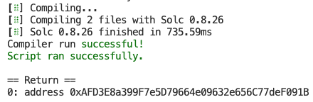

# SP1 Telepathy

## Overview

On-chain Ethereum light client built with SP1.

- `/program`: The SP1 Telepathy program
- `/contracts`: Contracts for the Telepathy light client
- `/primitives`: Common types shared between the program, contract, and script
- `/script`: Scripts for getting the contract's genesis parameters and generating proofs

## Getting Started
Use the existing light clients (e.g. for a bridge) or deploy and operate your own
### Deployments
Test (mock proof verifier): [`sepolia:0x0E2451C03C1B63D3187999ceDe8106a0eD1691c8`](https://sepolia.etherscan.io/address/0x0E2451C03C1B63D3187999ceDe8106a0eD1691c8)

Prod: TBA when SP1 goes to mainnet

### Deploy Contracts

#### 1. Generate genesis parameters for contract

1. `cd ./script`
2. `RUST_LOG=info cargo run --release --bin genesis`

#### 2. Deploy contracts with Foundry

1. Install [Foundry](https://book.getfoundry.sh/getting-started/installation)
2. `cd ../contracts`
3. `cp .env.example .env`
4. Paste the genesis parameters into `.env` and manually fill in the other parameters
5. `forge install`
6. `source .env`
7. `forge script script/Deploy.s.sol --rpc-url $RPC_URL --private-key $PRIVATE_KEY --etherscan-api-key $ETHERSCAN_API_KEY --broadcast --verify`
8. Take note of the light client contract address printed by the script
   
   

### Run Light Client

1. Install [SP1](https://docs.succinct.xyz/getting-started/install.html)
2. `cd ./script`
3. `cp .env.example .env`
4. Paste in the contract address in `.env` and fill out the other parameters

To update the light client once (for testing): `RUST_LOG=info cargo run --release --bin run`

To update the light client continuously (for production): `RUST_LOG=info cargo run --release --bin operator`
